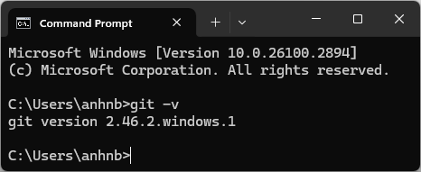
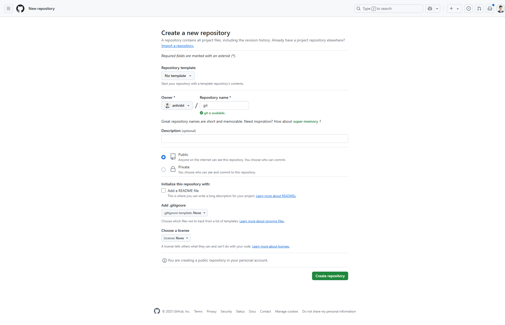
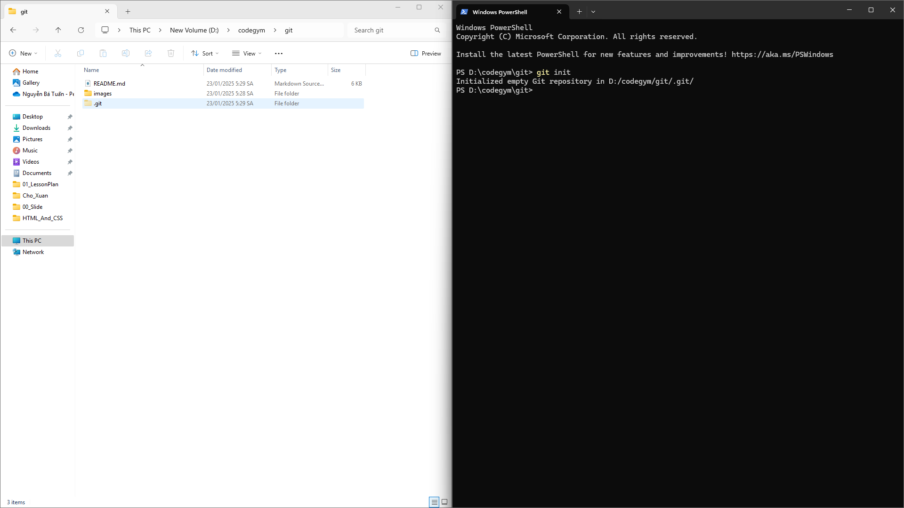
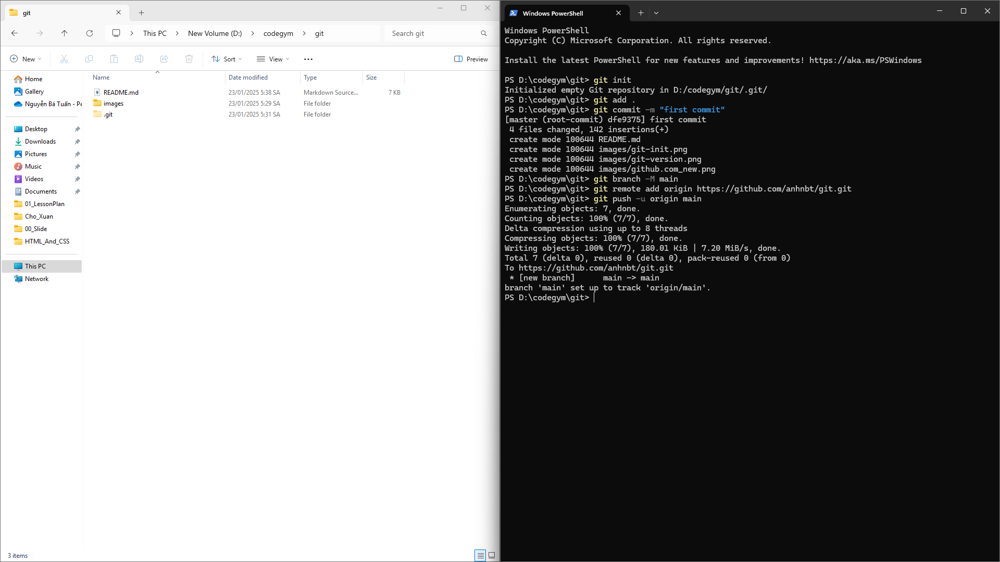

# Cài đặt Git và đẩy mã nguồn lên

### Mục tiêu

- Cài đặt Git trên máy tính của bạn (Windows hoặc macOS).
- Tạo một kho lưu trữ (repository viết tắt là repo) trên GitHub.
- Kết nối kho lưu trữ cục bộ (local repo) với kho lưu trữ từ xa (remote repo) trên GitHub.
- Đẩy các thay đổi lên kho lưu trữ từ xa (remote repo).

### Bước 1: Cài đặt Git

**Trên Windows:**

- **Tải về:** Truy cập trang web chính thức của Git ([https://git-scm.com/](https://www.google.com/url?sa=E&source=gmail&q=https://git-scm.com/)) và tải về bản cài đặt phù hợp.
- **Cài đặt:** Chạy file cài đặt và làm theo hướng dẫn. **Lưu ý:** Nên chọn tùy chọn "Use Git from the Windows Command Prompt" để có thể sử dụng Git từ Command Prompt.

**Trên macOS:**

- **Homebrew:** Nếu bạn đã cài đặt Homebrew, bạn có thể cài đặt Git bằng lệnh: `brew install git`
- **Tải về:** Nếu chưa cài đặt Homebrew, bạn có thể tải về bản cài đặt trực tiếp từ trang web của Git và làm theo hướng dẫn tương tự như trên Windows.

### Bước 2: Kiểm tra cài đặt

Mở một cửa sổ terminal (Command Prompt trên Windows, Terminal trên macOS) và nhập lệnh `git --version` hoặc `git -v`:

```bash
git --version
```



Nếu Git được cài đặt thành công, bạn sẽ thấy thông tin phiên bản Git hiện tại.

### Bước 3: Tạo tài khoản GitHub và kho lưu trữ

- **Tạo tài khoản:** Truy cập [https://github.com/](https://www.google.com/url?sa=E&source=gmail&q=https://github.com/) và đăng ký một tài khoản.
- **Tạo kho lưu trữ mới:** Nhấp vào nút "New" ở góc trên bên phải, điền thông tin cho kho lưu trữ của bạn (ví dụ: tên, mô tả) và nhấn "Create repository".



### Bước 4: Khởi tạo kho lưu trữ cục bộ (local repo)

- **Mở thư mục dự án:** Mở thư mục chứa dự án của bạn trong terminal.
- **Khởi tạo:** Nhập lệnh:

```bash
git init
```



Lệnh này sẽ tạo một thư mục ẩn tên là `.git` trong thư mục dự án của bạn, đây là nơi Git lưu trữ thông tin về kho lưu trữ cục bộ.

### Bước 5: Thêm các file vào kho lưu trữ

- **Thêm file:** Nhập lệnh:

```bash
git add <tên_file>
```

Để thêm tất cả các file, bạn có thể dùng:

```bash
git add .
```

### Bước 6: Commit các thay đổi

- **Commit:** Nhập lệnh:

```bash
git commit -m "Mô tả về thay đổi"
```

Thay "Mô tả về thay đổi" bằng một thông điệp ngắn gọn mô tả những gì bạn đã thay đổi.

### Bước 7: Đổi tên nhánh hiện tại thành main.

- Để đổi tên nhánh `master` thành `main`:

```bash
git branch -M main
```

- Sau khi thực hiện lệnh này, bạn sẽ thấy rằng nhánh hiện tại của bạn đã được đổi tên thành `main`.
- Nhánh `main` đang trở thành tiêu chuẩn mới cho nhánh mặc định trong nhiều dự án Git, thay thế cho nhánh `master` truyền thống.

### Bước 8: Kết nối kho lưu trữ cục bộ với kho lưu trữ từ xa

- **Sao chép URL:** Trên trang GitHub của kho lưu trữ, sao chép đường dẫn HTTPS.
- **Kết nối:** Nhập lệnh:

```bash
git remote add origin <đường_dẫn_HTTPS>
```

Thay `<đường_dẫn_HTTPS>` bằng đường dẫn bạn vừa sao chép.

### Bước 9: Đẩy các thay đổi lên kho lưu trữ từ xa

- **Đẩy:** Nhập lệnh:

```bash
git push -u origin main
```

Lệnh này sẽ đẩy các thay đổi từ nhánh `main` (mặc định) của kho lưu trữ cục bộ lên nhánh `main` của kho lưu trữ từ xa.



### Tham khảo thêm

- **Video hướng dẫn:** [HƯỚNG DẪN CÀI ĐẶT GIT](https://www.youtube.com/watch?v=lesqw7WzMFU&t=1s)
- **Tài liệu chính thức của Git:** [https://git-scm.com/doc](https://www.google.com/url?sa=E&source=gmail&q=https://git-scm.com/doc)

**Lưu ý:**

- **Nhánh:** Trong Git, nhánh (branch) là một con trỏ đến một commit cụ thể. Nhánh chính thường được gọi là `main`.
- **Remote:** Một remote là một phiên bản của kho lưu trữ được lưu trữ ở một nơi khác, ví dụ như trên GitHub.
- **Origin:** Tên thường được đặt cho remote chính của kho lưu trữ.

**Các lệnh Git thường dùng khác:**

- `git status`: Xem trạng thái hiện tại của kho lưu trữ.
- `git log`: Xem lịch sử các commit.
- `git branch`: Xem các nhánh hiện có.
- `git checkout <nhánh>`: Chuyển sang nhánh khác.
- `git merge <nhánh>`: Gộp nhánh khác vào nhánh hiện tại.

**Bài tập thực hành:**

- Tạo một dự án mới.
- Thêm một vài file vào dự án.
- Thực hiện các thay đổi và commit.
- Đẩy các thay đổi lên GitHub.
- Tạo một nhánh mới và thực hiện các thay đổi trên nhánh đó.
- Gộp nhánh mới vào nhánh chính.

**Chúc bạn thành công\!**

**Mở rộng:**

- **GitHub Desktop:** Nếu bạn không quen với dòng lệnh, bạn có thể sử dụng GitHub Desktop, một ứng dụng đồ họa giúp bạn làm việc với Git dễ dàng hơn.
- **GitKraken:** Một ứng dụng Git client khác với giao diện đẹp và nhiều tính năng hữu ích.

**Hy vọng hướng dẫn này sẽ giúp bạn bắt đầu làm quen với Git một cách dễ dàng\!**
